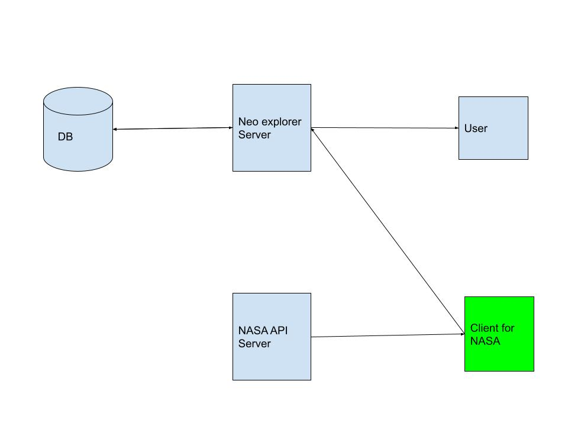

  <h3 align="center">NEO Explorer </h3>

   <p align="center">
     Near earth object explorer NASA client by Preeti for Data4life
    <br />
   </p>


<details open="open">
  <summary>Table of Contents</summary>
  <ol>
    <li><a href="#About">About NEO NASA Client</a></li>
    <li><a href="#Techstack">Techstack</a></li>
    <li><a href="#System-architecture">System architecture</a></li>
    <li><a href="#Getting-Started">Getting Started</a></li>
    <li><a href="#Testing">Testing</a></li>
    <li><a href="#Contact">Contact</a></li>
  </ol>
</details>


## About

This is a client application which helps download near earth objects 
data from NASA and post it to webserver accepting near earth object
data.

### Techstack 

All programming language, web frameworks, databases are the 
tools for a craftsperson called software engineer.
Most of these tools fits well for certain type of business problems.
This app is a cllient script which fetches data from a webserver and 
populates another. I think Python is suitable option here. 
I have used mentioned stack 


* [Python 3.8.2](https://www.python.org/downloads/release/python-382/) As Programming language for web server and client

## System architecture



## Getting Started 
## Setting up NASA client


1. Extract data4life_new_client.zip and change your directory to data4life_new_client
2. Set up virtual environment and install dependencies using
   ```shell
   pip install -r requirements.txt
   ```
3. Get a free API Key at [https://api.nasa.gov](hhttps://api.nasa.gov)
4. Clone the repo
   set above received api as environment variable using below command
   ```shell
   export NASA_API_KEY=<your_api_key_goes_here>
   ```

5. Please ensure correct endpoint of server is set using `NEO_SERVER_POST_ENDPOINT` 
environment variable.
   ```shell
   export NEO_SERVER_POST_ENDPOINT=<neo_server_post_endpoint_goes_here>
   ```

6. Run client app to populate database using API endpoints with data from NASA
   ```shell
   python main.py
   ```

## Testing
A wise engineer once said that `Something that is untested is broken.`
Well not always but most often.

I have used [pytest](https://docs.pytest.org/en/6.2.x/) to test the app.

Run tests with below command in project root and relax, pytest will do the job for you
```shell
pytest
```

## Contact

Preeti Bhardwaj - [LinkedIn](www.linkedin.com/in/bhardwaj-preeti) - sharma.pittu101@gmail.com
